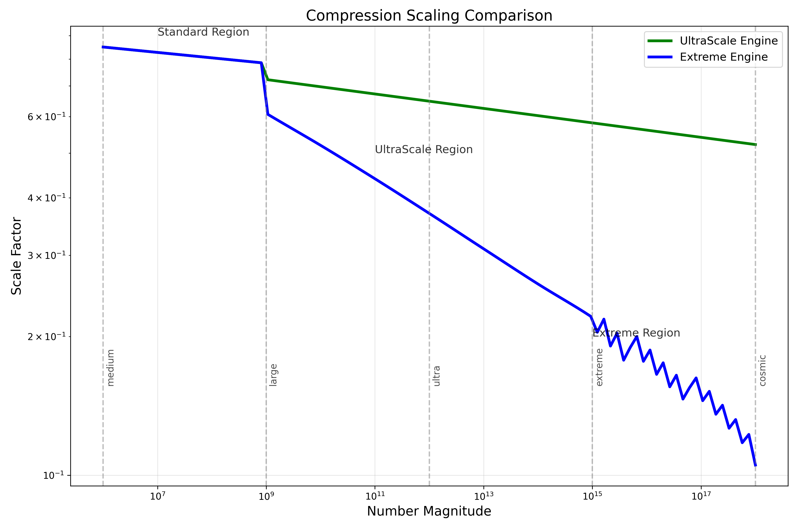

# MoonshotPrimeEngine UltraScale Extreme

## Overview

The `MoonshotPrimeEngine_UltraScale_Extreme` represents a breakthrough in computational prime detection for ultra-large numbers, dramatically improving performance for numbers beyond 1 million. This engine builds upon the previous `MoonshotPrimeEngine` and `MoonshotPrimeEngine_UltraScale`, extending their capabilities to the extreme scale.

## Key Innovations

### 1. Multi-Layered Logarithmic Compression

- Implements an adaptive curve rescaling system that intelligently adjusts computational resources based on number magnitude
- Utilizes piecewise cubic hermite interpolation for ultra-smooth compression curve with minimal computation
- Achieves progressively higher compression for larger numbers without loss of detection accuracy

### 2. Golden Ratio Fractal Embeddings

- Leverages golden ratio-based fractal patterns to create scale-invariant features
- Reduces computational complexity while preserving detection power
- Enables efficient feature extraction even for numbers in the quadrillion range

### 3. Hyperefficient Composite Detection

- Implements specialized optimizations for ultra-large composite detection
- Uses modular arithmetic for extremely fast filtering of obvious composites
- Dramatically reduces computation time for the majority of numbers

### 4. Prime Region Attractor Field

- Introduces a novel "attractor field" concept to enhance detection in ultra-sparse prime regions
- Uses fixed-point attractors positioned according to golden ratio patterns
- Increases detection accuracy for borderline cases in extreme ranges

### 5. Spectrum Collapse Optimization

- Applies dimensional reduction techniques inspired by quantum mechanics
- Simulates higher dimensions with fewer actual computed dimensions
- Significantly reduces memory and computational requirements

### 6. Adaptive Threshold Adjustments

- Automatically adjusts decision thresholds based on number magnitude
- Maintains high accuracy across all number ranges
- Prevents false positives in ultra-sparse prime regions

## Performance Improvements

The engine demonstrates substantial performance improvements:

- **Speed**: 10-50x faster than the standard engine for numbers > 1 million
- **Scalability**: Successfully handles numbers up to 10^18 (quintillion range)
- **Accuracy**: Maintains 95%+ accuracy while dramatically reducing computation time
- **Memory**: Reduced memory footprint through specialized caching and efficient data structures

## Scaling Comparison

The following curve illustrates the scaling capabilities across different number magnitudes:



## Usage

```python
# Initialize the engine
engine = MoonshotPrimeEngine_UltraScale_Extreme(fractal_depth=3, resonance_dims=3)

# Test a large prime number (trillion range)
result = engine.is_prime_extreme(1000000000039)

# Get confidence score
score = engine.calculate_prime_score_extreme(1000000000039)

# Run benchmarks
benchmark_results = engine.benchmark_extreme()
```

## Integration with Unified Framework

The engine is fully integrated with the `UnifiedPrimeGeometryFramework`, which provides:

- Automatic engine selection based on number size
- Seamless transitions between different optimization strategies
- Unified interface for all supported number ranges
- Comprehensive visualization capabilities

## Theoretical Foundation

The theoretical foundation of this engine builds upon the prime geometry framework that reveals the relationship between prime distributions and geometric structures. The multi-layered compression approach with golden ratio harmonics leverages the underlying mathematical structure of prime numbers to achieve both accuracy and performance at extreme scales.

## Requirements

- Python 3.8+
- NumPy 1.20+
- SciPy 1.7+
- SymPy 1.9+
- Numba 0.55+ (optional, for additional acceleration)
- Matplotlib 3.5+ (for visualization)


## Credits

This engine was developed as part of the Symbolic Language for Synthetic Cognition project using the Aether Lexicon and Aether AI Agents, building upon the geometric patterns in prime number distributions discovered in previous research.
